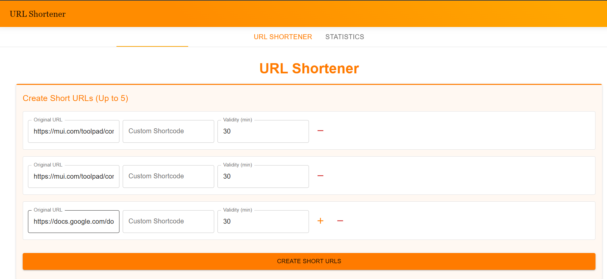
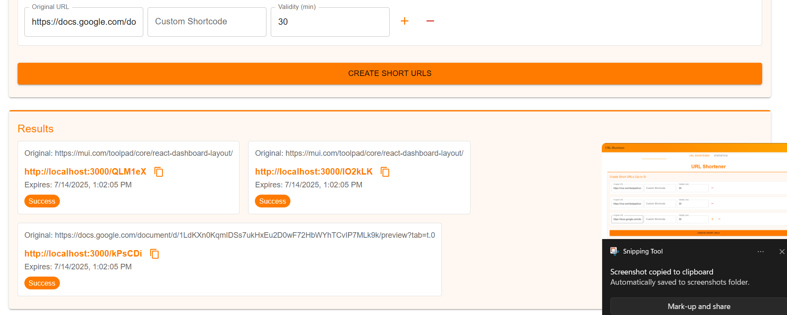
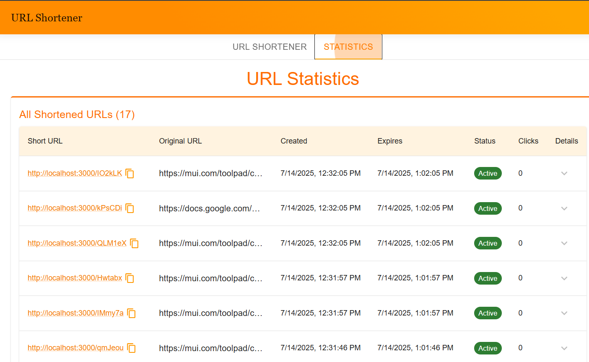

# URL Shortener



## Overview
This React-based URL shortener application allows users to create shortened URLs with optional custom shortcodes and expiration times. Built with Material-UI for a responsive and modern interface, it supports batch processing of up to 5 URLs at once.



## Features
- **Multiple URL Shortening**: Process up to 5 URLs simultaneously
- **Custom Shortcodes**: Optionally specify your own shortcode (alphanumeric, max 10 chars)
- **Expiration Control**: Set validity period in minutes (default: 30 minutes)
- **Responsive Design**: Works on mobile, tablet, and desktop devices
- **Error Handling**: Clear validation messages for invalid inputs
- **Copy Functionality**: One-click copy of shortened URLs

## Installation
Clone the repository:
```bash
git clone https://github.com/saras-69/12217473.git
cd Frontend
```

Install dependencies:
```bash
npm install
```

Start the development server:
```bash
npm run dev
```
## Usage
1. Enter up to 5 URLs in the input fields
2. Optionally specify custom shortcodes for each URL
3. Set expiration time in minutes (optional)
4. Click "Shorten URLs" to generate shortened links
5. Copy the shortened URLs using the copy button



## Requirements
- Node.js 
- npm or yarn package manager
- Modern web browser

## Tech Stack
- React 18
- Material-UI (MUI)
- JavaScript/ES6+
- CSS3
